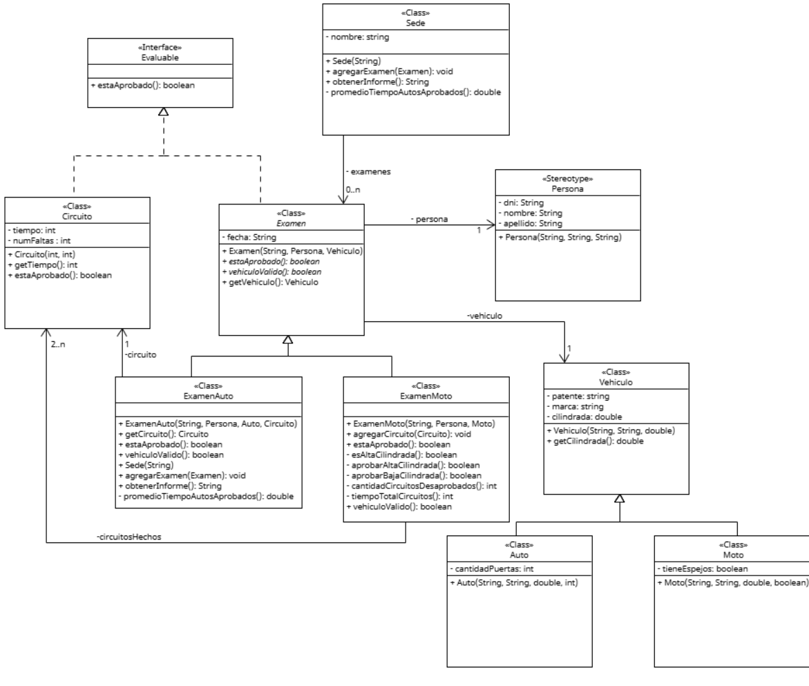

## Participantes

- [@ManuelaSuarez](https://github.com/ManuelaSuarez)
- [@NachoIgartua2](https://github.com/NachoIgartua2)

# Ejercicio Estadísticas de exámenes de conducir

La sede de licencias de conducir de una jurisdicción nos pide un prototipo para generar algunas estadísticas de los exámenes tomados.

Todo examen consta de una fecha (`String`) y la persona que lo hizo (DNI, nombre y apellido). Como parte del examen, se debe realizar un circuito en caso de concursar para licencia de auto y varios circuitos en caso de concursar para licencia de moto.

Los exámenes de moto guardan, además de los circuitos hechos, información sobre la moto con la que se hicieron las pruebas (patente, marca, cilindrada y si llevaba todos los espejos).

Los exámenes de auto guardan, además del único circuito realizado, información del auto con el que se hizo (patente, marca, cilindrada y cantidad de puertas).

De los circuitos (para cualquier tipo de examen) se sabe el tiempo en segundos que tomó y el número de faltas cometidas. Los circuitos y los exámenes son evaluables, ya que deben dar un resultado: aprobó o no.

## Condiciones para aprobar

### Circuitos:
- Tener 2 faltas o menos.

### Exámenes de auto:
- Que su circuito se haya aprobado en un minuto y medio o menos.

### Exámenes de moto:
- Si la cilindrada de la moto es superior a 150cc, todos los circuitos deben haber sido aprobados (sin importar el tiempo).
- Si la cilindrada de la moto es igual o inferior a 150cc, se puede tener hasta un solo circuito desaprobado y el tiempo total entre todos no debe superar los 2 minutos.

---

## Basado en el enunciado, realizar:
El método `obtenerInforme` que debe devolver (no mostrar por consola) los siguientes datos:
- Porcentaje de exámenes reprobados.
- Promedio de tiempo de los exámenes de auto aprobados.
